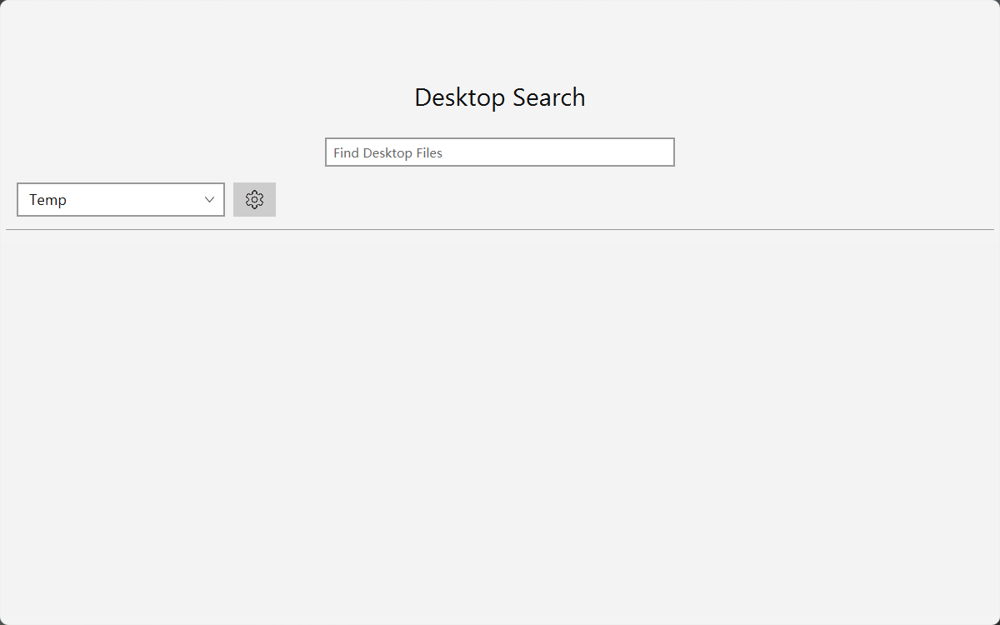
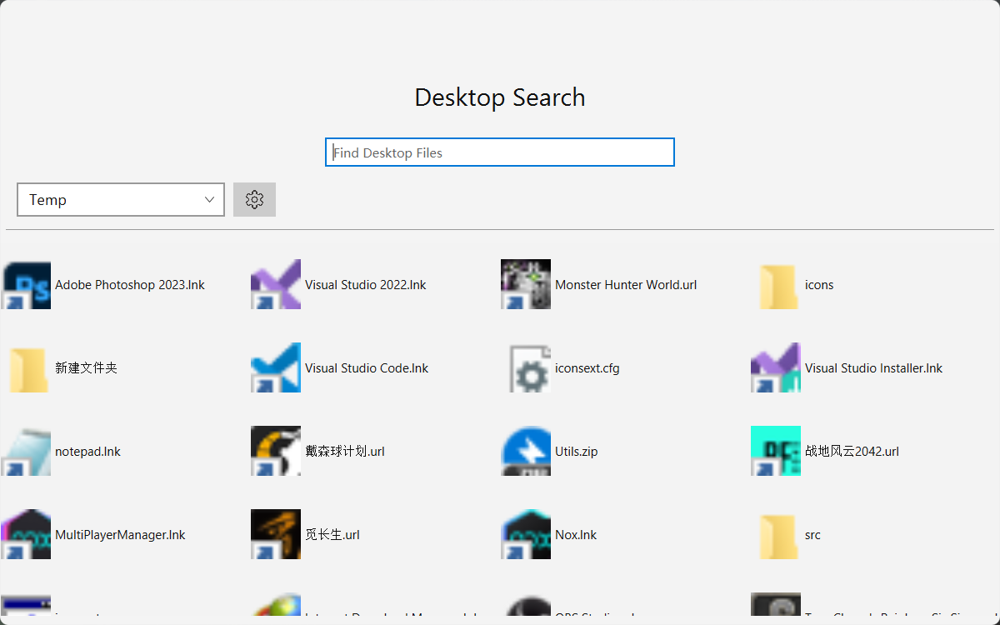
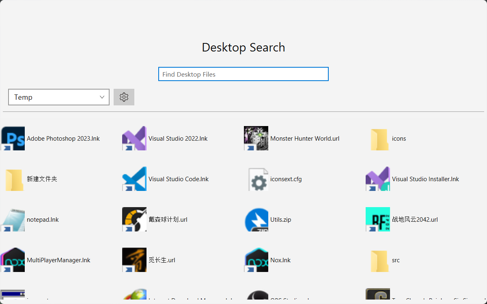

# IconAcquisition
一个用于获取高清图像的工具类，用于取代JKD17之前的FileSystemView和ShellFolder。

 [English](README.md) | **中文**

## 简单使用示例
```java
import system.jni.JavaFXUtils;

class Test{
    public static void main(String[] args) {
        //init the class
        JavaFXUtils.init();
        //get the icon
        JavaFXUtils.getIconImageFX(new File("test.exe"));
        JavaFXUtils.getIconImageBytes(new File("test.exe"));
    }
}
```
## 对比JDK17之前的API
### 这是一个临时的显示面板

### 这是一个用于展示结果的面板
```
public static Image getIcon(File file) throws IOException {
    if (file == null) {
        throw new FileNotFoundException("File is null");
    }
    try {
        return /*API*/;
    }catch (Exception e){
        log.error("Failed to get icon", e);
    }
    return null;
}
```
### 使用FileSystemView获取图标并显示它
```
try {
    return toFXImage(FileSystemView.getFileSystemView().getSystemIcon(file));
}catch (Exception e){
    log.error("Failed to get icon", e);
}
```

### 使用ShellFolder获取图标并显示它
```
try {
    return toFXImage(ShellFolder.getShellFolder(file).getIcon(true));
}catch (Exception e){
    log.error("Failed to get icon", e);
}
```

### 使用IconAcquisition获取图标并显示它
```
try {
    return JavaFXUtils.getIconImageFX(file,1200);
}catch (Exception e){
    log.error("Failed to get icon", e);
}
```


